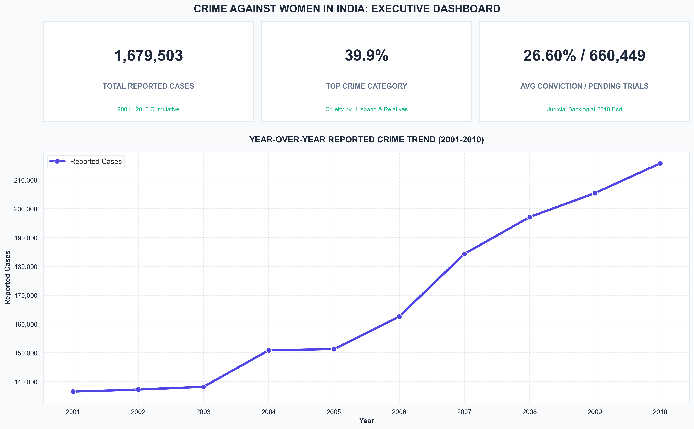
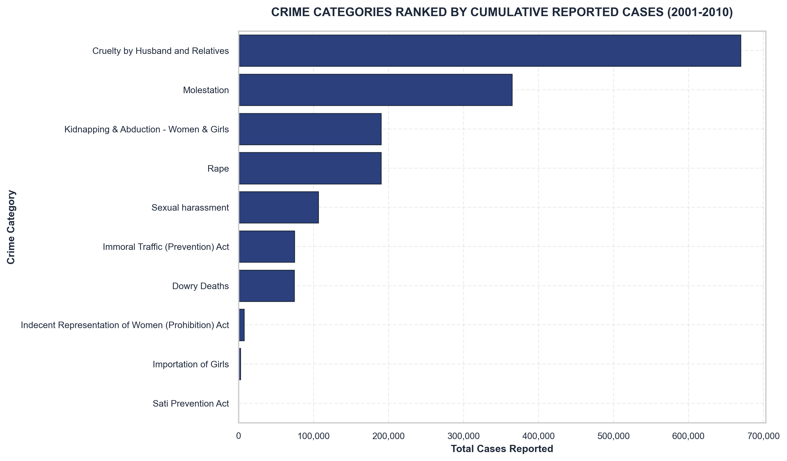
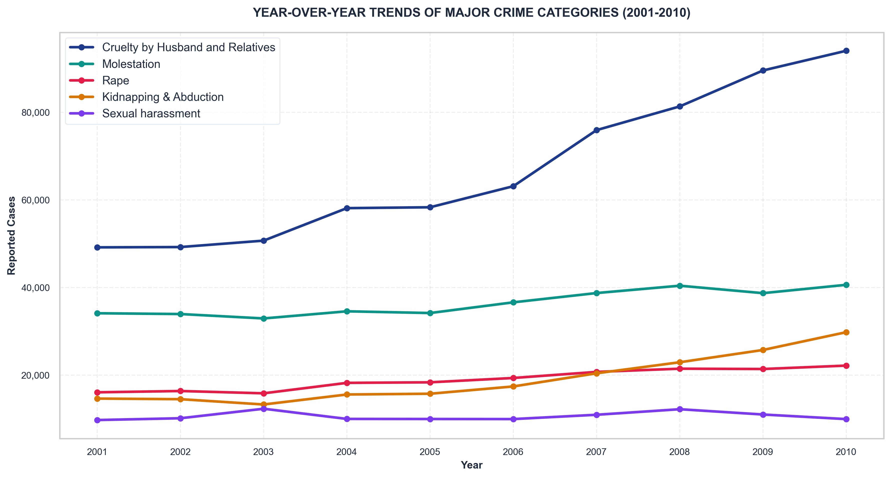
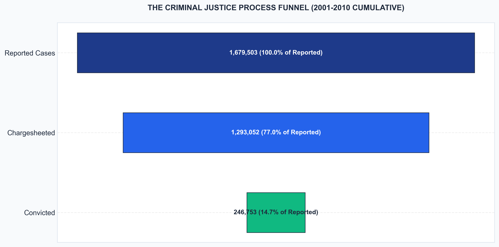

# Crime Against Women in India: Trends, Patterns & Judicial Outcomes Analysis

An end-to-end data analytics case study on crimes against women in India, focused on trend analysis, category concentration, state-level burden, conviction outcomes, judicial backlog, and investigation pipeline bottlenecks.

## Problem Statement
Crimes against women represent a critical social, human rights, and legal challenge. Understanding the patterns, geographic distribution, and efficiency of the judicial system is vital for formulating effective policies, allocating law enforcement resources, and ensuring timely justice. However, raw administrative records are often siloed, making it difficult to identify systemic bottlenecks and long-term trends. 

This project transforms raw NCRB-style administrative records into an analytical case study, providing a data-driven overview of the criminal justice pipeline.

## Business / Policy Questions
This analysis aims to address the following key questions:
1. **Crime Dynamics**: Which crime categories account for the largest shares of reported cases, and how have they evolved over time?
2. **Geographical Burden**: Which states and union territories bear the highest absolute reported crime burden, and where are resources most needed?
3. **Judicial Throughput**: What are the conviction and acquittal rates across different crime categories, and where are the disparities?
4. **Pipeline Bottlenecks**: How severe are the bottlenecks in the police investigation and judicial trial phases? Is the system keeping pace with rising registrations?

## Dataset Overview
- **Primary File**: `42_Cases_under_crime_against_women.csv`
- **Raw Dataset Size**: 4,167 rows and 22 columns.
- **Cleaned Dataset Size**: 3,850 category-level records (excluding aggregate totals) across 22 columns.
- **Coverage**: 2001–2010 annual data across all 35 Indian States and Union Territories.
- **Core Fields Used**:
  - `Area_Name` (State / Union Territory)
  - `Year` (Reporting year)
  - `Group_Name` (Primary crime category)
  - `Cases_Reported` (Cases reported during the year)
  - `Cases_Chargesheeted` (Cases chargesheeted by police)
  - `Cases_Sent_for_Trial` (Cases sent to trial)
  - `Cases_Trials_Completed` (Trials completed during the year)
  - `Cases_Convicted` (Cases resulting in conviction)
  - `Cases_Acquitted_or_Discharged` (Cases acquitted or discharged)
  - `Cases_Pending_Investigation_at_Year_End` (Cases pending investigation at year end)
  - `Cases_Pending_Trial_at_Year_End` (Cases pending trial at year end)

## Methodology
The analysis follows a reproducible public policy analytics workflow:
1. **Data Ingestion & Cleaning**: Loading NCRB-style tables, standardizing schemas, casting data types, handling missing values, and separating category-level records from total aggregate summaries.
2. **Descriptive & Ranking Analysis**: Profiling and ranking crime categories by cumulative reported volume.
3. **Temporal Trend Analysis**: Analyzing annual changes in total reported crimes and comparing the trajectories of major crime categories.
4. **Geographical Profiling**: Mapping caseload concentration across states and union territories to identify high-burden locations.
5. **Judicial Pipeline & Backlog Diagnostics**: Evaluating conviction rates and tracing active pending cases over time to measure court backlog growth.
6. **Process Funnel Mapping**: Modeling the flow of cases from registration to chargesheeting, trial entrance, and conviction to isolate pipeline bottlenecks.
7. **Correlation Profiling**: Mapping relations between police throughput and court backlogs.

## Key Findings
Based on the computed analytics, the following insights were derived:
- **Most reported crime category**: *Cruelty by Husband and Relatives* is the dominant offense, with **669,539** cases (representing **39.87%** of all non-aggregate reported crimes).
- **Decadal reporting trend**: Reported crimes against women rose from **136,570** in 2001 to **215,740** in 2010, representing a net **57.97%** increase.
- **Geographic distribution**: *Andhra Pradesh* has the highest cumulative burden (**199,612** cases), while *Lakshadweep* represents the lowest (**18** cases).
- **Conviction disparities**: Conviction rates are highest for *Sexual Harassment* (**56.82%**) and lowest for *Cruelty by Husband and Relatives* (**20.57%**).
- **Court backlog growth**: Cumulative pending trials grew by **69.69%** over the decade, reaching a peak of **660,449** cases in 2010.
- **Police pipeline pressure**: A significant bottleneck exists at the pre-trial phase, with **29.57%** of all active cases pending investigation at year-end.

## Visualizations
Below are primary visualizations generated during the analysis:

### 1. Executive Summary Dashboard

*A high-level dashboard summarizing cumulative reported cases, top category shares, average conviction rates, pending trial cases, and the overall decadal trend.*

### 2. Crime Category Analysis

*Ranking of crime categories by cumulative reported volume, showing the dominance of Cruelty by Husband & Relatives (39.87%) and Molestation.*

### 3. Decadal Category Trends

*Progression of major categories from 2001 to 2010, demonstrating the rapid rise in domestic cruelty reports compared to other offenses.*

### 4. Criminal Justice Flow Funnel

*A horizontal funnel diagram illustrating the significant drop-off from reported cases (100%) to police chargesheets (77.0%), trials (74.9%), and final convictions (13.9%).*

## Insights
1. **The Domestic Violence Burden**: Since domestic cruelty represents nearly 40% of the total caseload and is growing faster than any other category, public safety and family support services must dedicate substantial resources to domestic dispute resolution and shelters.
2. **The Prosecution Bottleneck**: The low conviction rate (20.57%) and high acquittal rate (79.43%) in domestic cruelty cases suggests that reliance on witness testimony alone is often ineffective, highlighting the need for forensic evidence collection protocols.
3. **The Court Backlog Crisis**: The 70% growth in pending trials shows that the court system cannot keep pace with rising case registrations, turning the judiciary into the primary reservoir for unresolved cases.

## Technologies Used
- **Python** (Core Logic)
- **Pandas & NumPy** (Data Ingestion, Cleaning & Manipulation)
- **Matplotlib & Seaborn** (Data Visualization & Infographics)
- **Plotly** (Interactive Dropdown Explorer)
- **Jupyter Notebook** (Analysis Environment)

## Repository Structure
```text
crime-against-women-analysis-india/
├── data/
│   └── 42_Cases_under_crime_against_women.csv
├── notebooks/
│   └── crime_against_women_analysis.ipynb
├── images/
│   ├── project_dashboard.png
│   ├── crime_trends_over_time.png
│   ├── crime_category_distribution.png
│   ├── conviction_rate_analysis.png
│   ├── judicial_backlog_analysis.png
│   ├── correlation_heatmap.png
│   ├── category_trends_over_time.png
│   ├── investigation_funnel.png
│   └── key_findings.png
├── README.md
├── requirements.txt
└── LICENSE
```

## Future Scope
- **Geospatial Mapping**: Integrate interactive choropleth maps to display state-level rates.
- **Population Normalization**: Calculate crime rates per 100,000 women to provide a more accurate geographic comparison.
- **Legislative Benchmarking**: Evaluate changes in trends before and after key policy interventions (e.g., the Domestic Violence Act of 2005).

## Author
**Shubham**  
Data Analytics Project
