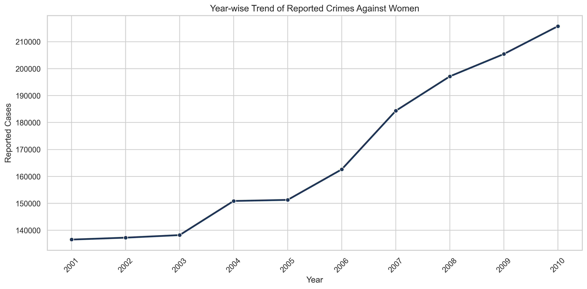
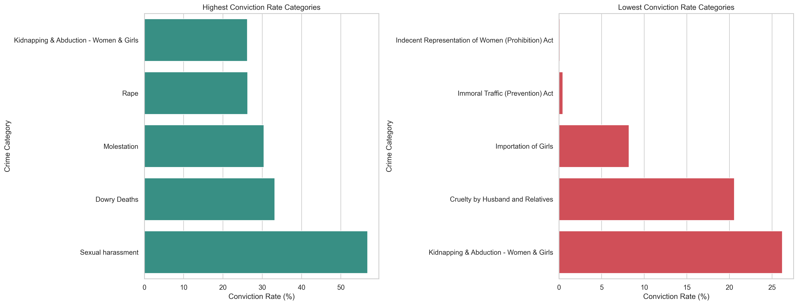

# Crime Against Women in India: Trends, Patterns & Judicial Outcomes Analysis

An end-to-end data analytics case study on crimes against women in India, focused on trend analysis, category concentration, state-level burden, conviction/acquittal outcomes, judicial backlog, and investigation pipeline bottlenecks.

## Executive Summary
This project analyzes **3,850 cleaned NCRB records** (derived from **4,167 raw records**) of crimes against women in India over a **10-year period (2001–2010)**, covering **10 distinct crime categories** across all states and union territories. 

### Key Analytical Findings:
* **Dominance of Domestic Abuse**: *Cruelty by Husband and Relatives* is the single largest crime category, accounting for **39.87%** of all reported crimes against women.
* **Escalating Reporting Volume**: Overall reported cases rose by **57.97%** over the decade (from **136,570** in 2001 to **215,740** in 2010).
* **Massive Judicial Backlog**: Pending trials increased by **69.69%** (climbing from **389,201** to **660,449** cases), creating severe judicial bottlenecks.
* **Low Conviction Rates for Domestic Abuse**: Conviction rates vary widely by category, from **56.82%** for *Sexual harassment* to a critically low **20.57%** for *Cruelty by Husband and Relatives*, which also suffers from a **79.43%** acquittal rate.
* **Pre-Trial Bottlenecks**: **29.57%** of all active cases remain stuck in the police investigation pipeline at year-end, failing to reach courts.

## Project Overview
This project converts raw NCRB-style crime records into a structured analytical narrative suitable for policy-oriented exploration and portfolio presentation.  
The notebook emphasizes:
- clean and reproducible data workflow,
- interpretable visualizations,
- metric-driven judicial outcome analysis, and
- evidence-backed storytelling.

## Project Highlights
* **3,850 cleaned records analyzed** covering a 10-year span (2001–2010).
* **End-to-End Analytics Workflow**: Covers data loading, automated schema cleaning, correlation mapping, pipeline analysis, and policy implications.
* **Interactive Plotly Explorer**: Built a dynamic, dropdown-based visualization to filter and explore trends for major categories in real-time.
* **Metric-Driven Outcome Auditing**: Deep dive into conviction rates, acquittal ratios, judicial backlog growth, and investigation bottlenecks.
* **Saved Visual Assets**: All 11 major charts and dashboards are automatically exported to the `images/` directory at high resolution (300 DPI) for portfolio readiness.

## Dataset Information
- **Primary file**: `42_Cases_under_crime_against_women.csv`
- **Expected location**: `data/42_Cases_under_crime_against_women.csv`
- **Coverage in this notebook**: 2001–2010 records (dynamically verified from data)
- **Core fields used**:
  - `Area_Name` (State / Union Territory)
  - `Year` (Reporting year)
  - `Group_Name` (Primary crime category)
  - `Sub_Group_Name` (Sub-category within the crime category)
  - `Cases_Reported` (Cases reported during the year)
  - `Cases_Convicted` (Cases resulting in conviction)
  - `Cases_Acquitted_or_Discharged` (Cases acquitted or discharged)
  - `Cases_Trials_Completed` (Trials completed during the year)
  - `Cases_Pending_Trial_at_Year_End` (Cases pending trial at year end)
  - `Cases_Chargesheeted` (Cases chargesheeted by police)
  - `Cases_Sent_for_Trial` (Cases sent to trial)
  - `Cases_Pending_Investigation_at_Year_End` (Cases pending investigation at year end)

## Project Objectives
1. Quantify category-wise and year-wise crime patterns.
2. Identify high-burden states/UTs and low-burden comparators.
3. Evaluate conviction and acquittal dynamics using derived metrics.
4. Assess judicial pendency and unresolved case pressure.
5. Analyze pipeline bottlenecks between investigation and trial.
6. Provide an interactive explorer for category-level trend inspection.

## Technologies Used
- **Python**
- **Pandas, NumPy** (data manipulation)
- **Matplotlib, Seaborn** (static visual analytics)
- **Plotly** (interactive analytics)
- **Jupyter Notebook** (analysis narrative)

## Analysis Workflow
1. **Introduction & Framing**
2. **Executive Summary**
3. **Dataset Overview**
4. **Data Quality Validation**
5. **Executive Dashboard**
6. **Crime Category Analysis**
7. **Year-wise Trend Analysis**
8. **State-wise Top/Bottom Burden Analysis**
9. **Conviction Rate Analysis**
10. **Acquittal Rate Analysis**
11. **Judicial Backlog Analysis**
12. **Investigation Pipeline Analysis**
13. **Judicial Metrics Correlation Analysis**
14. **Interactive Category Explorer (Plotly dropdown)**
15. **Policy Implications**
16. **Key Findings & Conclusion**

## Sample Visualizations
Below are key visualizations generated during the analysis:

### 1. Executive Dashboard

*A premium executive dashboard consolidating cumulative metrics, showing total reported crimes, category breakdowns, average conviction rates, pending trial cases, and the overall decadal trend.*

### 2. Crime Category Analysis

*Distribution of reported cases across all 10 non-aggregate categories, demonstrating the overwhelming dominance of Cruelty by Husband & Relatives (39.87%) and Molestation.*

### 3. Crime Trend Analysis

*Yearly progression of reported crimes against women in India, highlighting a steady 57.97% rise from 2001 to 2010, which potentially points to increased reporting awareness.*

### 4. Conviction Analysis

*Side-by-side comparison of categories with the highest conviction rates (e.g., Sexual Harassment) versus the lowest conviction rates (e.g., Cruelty by Husband & Relatives), highlighting structural judicial disparities.*

## Key Findings
Based on the computed analytics, the following insights were derived:
- **Most reported crime category**: *Cruelty by Husband and Relatives* with **669,539** cases (representing **39.87%** of all non-aggregate reported crimes).
- **Decadal reporting trend**: Reported crimes against women increased from **136,570** in 2001 to **215,740** in 2010, representing a net **57.97%** increase.
- **Geographic distribution**: *Andhra Pradesh* has the highest cumulative burden (**199,612** cases), while *Lakshadweep* represents the lowest (**18** cases).
- **Conviction disparities**: Conviction rates are highest for *Sexual Harassment* (**56.82%**) and lowest for *Cruelty by Husband and Relatives* (**20.57%**).
- **Acquittal rates**: Acquittal is highest in *Cruelty by Husband and Relatives* (**79.43%**) and lowest in *Sexual Harassment* (**43.18%**).
- **Judicial backlog growth**: Cumulative pending trials grew by **69.69%** over the decade, reaching a peak of **660,449** cases in 2010.
- **Police pipeline pressure**: A significant bottleneck exists at the pre-trial phase, with **29.57%** of all active cases pending investigation at year-end.

## Repository Structure
```text
crime-against-women-analysis-india/
├── data/
│   └── 42_Cases_under_crime_against_women.csv
├── notebooks/
│   └── Crime_Against_Women.ipynb
├── images/
│   ├── project_dashboard.png
│   ├── crime_category_distribution.png
│   ├── crime_trends_over_time.png
│   ├── top_10_states.png
│   ├── bottom_10_states.png
│   ├── conviction_rate_analysis.png
│   ├── acquittal_rate_analysis.png
│   ├── judicial_backlog_analysis.png
│   ├── pending_trials_over_time.png
│   ├── investigation_pipeline.png
│   └── correlation_heatmap.png
├── README.md
├── requirements.txt
└── LICENSE
```

## How to Run
1. Clone the repository.
2. Create and activate a Python virtual environment.
3. Install dependencies:
   ```bash
   pip install -r requirements.txt
   ```
4. Launch Jupyter:
   ```bash
   jupyter notebook
   ```
5. Open:
   - `notebooks/Crime_Against_Women.ipynb`

## Future Improvements
- Extend analysis to newer years and compare pre/post policy periods.
- Add population-normalized rates for fair state-level comparison.
- Integrate geospatial visualizations (choropleths).
- Add forecasting models for selected categories.
- Build a lightweight dashboard (e.g., Streamlit) for non-technical stakeholders.

## Author
**Shubham**  
Data Analytics Portfolio Project
