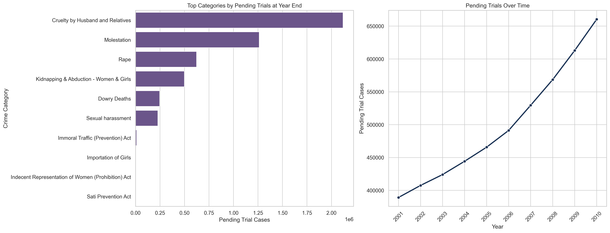

# Crime Against Women in India: A Decade of Trends, Judicial Outcomes & Policy Insights (2001–2010)

An end-to-end data analytics case study on crimes against women in India, focused on trend analysis, category concentration, state-level burden, conviction outcomes, judicial backlog, and investigation pipeline bottlenecks.

## Executive Summary
This project analyzes **3,850 cleaned NCRB records** (derived from **4,167 raw records**) of crimes against women in India over a **10-year period (2001–2010)**, covering **10 distinct crime categories** across all states and union territories. 

### Key Analytical Findings:
* **Dominance of Domestic Abuse**: *Cruelty by Husband and Relatives* is the single largest crime category, accounting for **39.87%** of all reported crimes against women.
* **Escalating Reporting Volume**: Overall reported cases rose by **57.97%** over the decade (from **136,570** in 2001 to **215,740** in 2010).
* **Massive Judicial Backlog**: Pending trials increased by **69.69%** (climbing from **389,201** to **660,449** cases), creating severe judicial bottlenecks.
* **Low Conviction Rates for Domestic Abuse**: Conviction rates vary widely by category, from **56.82%** for *Sexual harassment* to a critically low **20.57%** for *Cruelty by Husband and Relatives*, which also suffers from a **79.43%** acquittal rate.
* **Pre-Trial Bottlenecks**: **29.57%** of all active cases remain stuck in the police investigation pipeline at year-end, failing to reach courts.

## Problem Statement
Crimes against women represent a critical social, human rights, and legal challenge. Understanding the patterns, geographic distribution, and efficiency of the judicial system is vital for formulating effective policies, allocating law enforcement resources, and ensuring timely justice. However, raw administrative records are often siloed, making it difficult to identify systemic bottlenecks and long-term trends. 

This project transforms raw NCRB-style administrative records into an analytical case study, providing a data-driven overview of the criminal justice pipeline.

## Business / Policy Questions
This analysis aims to address the following key questions:
1. **Crime Dynamics**: Which crime categories account for the largest shares of reported cases, and how have they evolved over time?
2. **Geographical Burden**: Which states and union territories bear the highest absolute reported crime burden, and where are resources most needed?
3. **Judicial Throughput**: What are the conviction and acquittal rates across different crime categories, and where are the disparities?
4. **Pipeline Bottlenecks**: How severe are the bottlenecks in the police investigation and judicial trial phases? Is the system keeping pace with rising registrations?

## Dataset Overview
- **Primary File**: `42_Cases_under_crime_against_women.csv`
- **Raw Dataset Size**: 4,167 rows and 22 columns.
- **Cleaned Dataset Size**: 3,850 category-level records (excluding aggregate totals) across 22 columns.
- **Coverage**: 2001–2010 annual data across all 35 Indian States and Union Territories.
- **Core Fields Used**:
  - `Area_Name` (State / Union Territory)
  - `Year` (Reporting year)
  - `Group_Name` (Primary crime category)
  - `Cases_Reported` (Cases reported during the year)
  - `Cases_Chargesheeted` (Cases chargesheeted by police)
  - `Cases_Sent_for_Trial` (Cases sent to trial)
  - `Cases_Trials_Completed` (Trials completed during the year)
  - `Cases_Convicted` (Cases resulting in conviction)
  - `Cases_Acquitted_or_Discharged` (Cases acquitted or discharged)
  - `Cases_Pending_Investigation_at_Year_End` (Cases pending investigation at year end)
  - `Cases_Pending_Trial_at_Year_End` (Cases pending trial at year end)

## Methodology
The analysis follows a reproducible public policy analytics workflow:
1. **Data Ingestion & Cleaning**: Loading NCRB-style tables, standardizing schemas, casting data types, handling missing values, and separating category-level records from total aggregate summaries.
2. **Descriptive & Ranking Analysis**: Profiling and ranking crime categories by cumulative reported volume.
3. **Temporal Trend Analysis**: Analyzing annual changes in total reported crimes and comparing the trajectories of major crime categories.
4. **Geographical Profiling**: Mapping caseload concentration across states and union territories to identify high-burden locations.
5. **Judicial Pipeline & Backlog Diagnostics**: Evaluating conviction rates and tracing active pending cases over time to measure court backlog growth.
6. **Process Funnel Mapping**: Modeling the flow of cases from registration to chargesheeting, trial entrance, and conviction to isolate pipeline bottlenecks.
7. **Correlation Profiling**: Mapping relations between police throughput and court backlogs.

## Skills Demonstrated
- **Data Cleaning** (handling type casting, missing value audits, duplicate checks, aggregate separation)
- **Exploratory Data Analysis** (descriptive profiling, category rankings, and line/bar charting)
- **Statistical Analysis** (Pearson correlation matrix mapping and decadal trend delta calculations)
- **Data Visualization** (Matplotlib subplots, custom KPI dashboards, and centered horizontal process funnels)
- **Dashboard Design** (structured layouts, typography sizing, and light bordered cards)
- **Public Policy Analytics** (pipeline throughput diagnostics and court backlog bottlenecks quantification)
- **Insight Generation** (drawing analytical deductions and policy recommendations from data outputs)
- **Business Communication** (drafting clear executive summaries and storytelling documentation)

## Key Findings
Based on the computed analytics, the following insights were derived:
- **Most reported crime category**: *Cruelty by Husband and Relatives* is the dominant offense, with **669,539** cases (representing **39.87%** of all non-aggregate reported crimes).
- **Decadal reporting trend**: Reported crimes against women increased from **136,570** in 2001 to **215,740** in 2010, representing a net **57.97%** increase.
- **Geographic distribution**: *Andhra Pradesh* has the highest cumulative burden (**199,612** cases), while *Lakshadweep* represents the lowest (**18** cases).
- **Conviction disparities**: Conviction rates are highest for *Sexual Harassment* (**56.82%**) and lowest for *Cruelty by Husband and Relatives* (**20.57%**).
- **Court backlog growth**: Cumulative pending trials grew by **69.69%** over the decade, reaching a peak of **660,449** cases in 2010.
- **Police pipeline pressure**: A significant bottleneck exists at the pre-trial phase, with **29.57%** of all active cases pending investigation at year-end.

## Visualizations
Below are primary visualizations generated during the analysis:

### 1. Executive Summary Dashboard

*A high-level dashboard consolidating decadal statistics, showing total reported crimes, category breakdowns, average conviction rates, pending trial cases, and the overall decadal trend.*

### 2. Crime Category Analysis

*Ranking of crime categories by cumulative reported volume, showing the dominance of Cruelty by Husband & Relatives (39.87%) and Molestation.*

### 3. Decadal Category Trends

*Progression of major categories from 2001 to 2010, demonstrating the rapid rise in domestic cruelty reports compared to other offenses.*

### 4. Criminal Justice Flow Funnel

*A horizontal funnel diagram illustrating the case drop-off from initial registration (100.0%) to police chargesheets (77.0%) and final convictions (14.7%).*

### 5. Judicial Backlog Analysis

*Side-by-side subplot tracking the cumulative trial backlog by category (led by domestic cruelty) and the 69.7% growth of active pending trials over the decade.*

## Insights
1. **The Domestic Violence Burden**: Since domestic cruelty represents nearly 40% of the total caseload and is growing faster than any other category, public safety and family support services must dedicate substantial resources to domestic dispute resolution and shelters.
2. **The Prosecution Bottleneck**: The low conviction rate (20.57%) and high acquittal rate (79.43%) in domestic cruelty cases suggests that reliance on witness testimony alone is often ineffective, highlighting the need for forensic evidence collection protocols.
3. **The Court Backlog Crisis**: The 70% growth in pending trials shows that the court system cannot keep pace with rising case registrations, turning the judiciary into the primary reservoir for unresolved cases.
4. **Law Enforcement & Judicial Correlations**: Cases reported, chargesheeted, and sent for trial exhibit extremely strong positive correlations (>0.95), indicating that police and judicial workload scales almost directly with crime registration volume. In contrast, convictions show only moderate correlation (~0.65), suggesting that increased registrations do not automatically translate into successful prosecution outcomes. This highlights systemic challenges in prosecution effectiveness and judicial throughput.

## Policy Recommendations
Based on the empirical findings, the following actions are recommended:
1. **Strengthen Domestic Violence Intervention Programs**: Since *Cruelty by Husband & Relatives* accounts for nearly 40% (**39.87%**) of reported cases, public policy must prioritize domestic abuse interventions, counseling networks, and dedicated legal desks.
2. **Expand Judicial Capacity and Fast-Track Courts**: With active pending trials increasing by **69.69%** over the decade, expanding court systems is critical to reduce the growing pending-trial backlogs.
3. **Improve Evidence Collection & Forensic Support**: Low conviction outcomes for domestic cruelty (**20.57%**) highlight the need to transition away from witness reliance to medical/forensic protocols and witness protection.
4. **Allocate Resources Strategically**: Target infrastructure expansion and court funding to high-burden states (like Andhra Pradesh and Uttar Pradesh) carrying the largest reported caseloads.

## Limitations
This analysis incorporates several analytical limitations:
- **Temporal Constraints**: The analysis is restricted to the **2001–2010** decadal dataset. Recent trends and reforms are not reflected.
- **Reporting Bias**: Results depend on officially reported crime records. Due to social stigmas, significant underreporting may affect observed patterns.
- **Lack of Normalization**: Population-adjusted crime rates were not available in the raw NCRB dataset, making absolute counts higher in highly populated states.
- **Descriptive Focus**: The analysis focus is on descriptive and diagnostic insights rather than causal inference.

## Technologies Used
- **Python** (Core Logic)
- **Pandas & NumPy** (Data Ingestion, Cleaning & Manipulation)
- **Matplotlib & Seaborn** (Data Visualization & Infographics)
- **Plotly** (Interactive Dropdown Explorer)
- **Jupyter Notebook** (Analysis Environment)

## Repository Structure
```text
crime-against-women-analysis-india/
├── data/
│   └── 42_Cases_under_crime_against_women.csv
├── notebooks/
│   └── crime_against_women_analysis.ipynb
├── images/
│   ├── project_dashboard.png
│   ├── crime_trends_over_time.png
│   ├── crime_category_distribution.png
│   ├── conviction_rate_analysis.png
│   ├── judicial_backlog_analysis.png
│   ├── correlation_heatmap.png
│   ├── category_trends_over_time.png
│   ├── investigation_funnel.png
│   └── key_findings.png
├── README.md
├── requirements.txt
└── LICENSE
```

## Future Scope
- **Geospatial Mapping**: Integrate interactive choropleth maps to display state-level rates.
- **Population Normalization**: Calculate crime rates per 100,000 women to provide a more accurate geographic comparison.
- **Legislative Benchmarking**: Evaluate changes in trends before and after key policy interventions (e.g., the Domestic Violence Act of 2005).

## Author
**Shubham**  
Data Analytics Project
